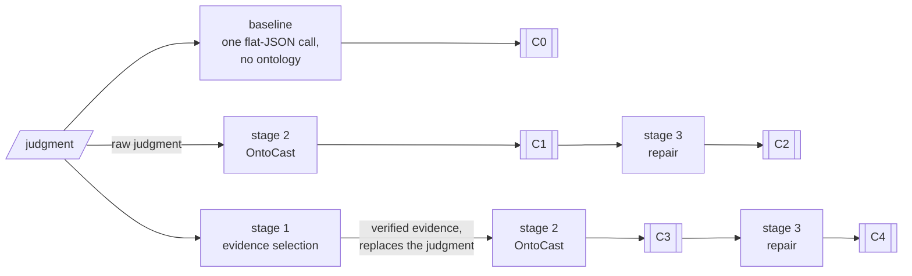

# Ablation study: what an evidence stage and a repair stage contribute to ontology-guided extraction

This directory implements a five-condition ablation over a pipeline that
extracts the **domestic procedural history** of a case — the chain of national
proceedings, the authorities that decided them, the parties to each, and their
outcomes — from European Court of Human Rights judgments, as an RDF graph
against a fixed domain ontology.

The study asks a question that generalises beyond this corpus: **when an LLM
writes a knowledge graph against an ontology, how much of the result's quality
comes from the ontology, how much from constraining the model to verbatim
evidence, and how much from a validation-driven repair pass?** Each is added and
removed independently and scored at both extraction and post-repair
checkpoints.

This README is the methods description and the reproduction procedure. The
experiment plan it implements is `docs/JURIX_2.md`; the ontology and its SHACL
shapes are in `ontology/`.

---

## 1 · Method

### 1.1 The three components under test

| component | what it does | implementation |
|---|---|---|
| **Ontology guidance** (stage 2) | extraction is rendered as RDF against a fixed domain ontology, with closed vocabularies, typed nodes and SHACL shapes | [OntoCast](https://growgraph.github.io/ontocast/), an external LLM-to-knowledge-graph framework, in `render_mode=facts`; invoked by `run_native.py` |
| **Evidence stage** (stage 1) | an extractive pass returns *verbatim spans* of the source; character offsets are computed programmatically, and any span that cannot be located in the source is discarded. The graph stage then sees the verified spans instead of the judgment | `compress.py` + `render_bundles.py` |
| **Repair stage** (stage 3) | a validation-driven pass: deterministic structural rewrites, an LLM loop over constraint violations, and one document-reading review restricted to adding evidence-anchored facts | `new_repair.py` |

### 1.2 Conditions

One model throughout (`gemma-4-31b`, served locally by vLLM), one document set,
five conditions.

| # | condition | evidence stage | ontology-guided graph | repair stage |
|---|---|:-:|:-:|:-:|
| **C0** | schema-light JSON baseline, one call, no ontology | — | — | — |
| **C1** | OntoCast alone — ontology-guided extraction from the raw judgment | — | ✓ | — |
| **C2** | C1 + repair | — | ✓ | ✓ |
| **C3** | evidence stage → ontology-guided extraction | ✓ | ✓ | — |
| **C4** | full pipeline | ✓ | ✓ | ✓ |

C1–C4 form a 2 × 2 factorial (evidence × repair), so each main effect is
estimated twice and the interaction is available. C0 sits outside the factorial
as a **matched** no-ontology baseline: the same task, the same target fields,
the same single call over the whole document, requested as flat JSON with no
schema, no closed vocabularies and no validation. Its prompt is published
verbatim (`art6/conditions/prompts/o1_schema_light.txt`) so that readers can
judge whether the baseline is a fair one.

### 1.3 Contrasts

| contrast | isolates | interpretation |
|---|---|---|
| **C1 vs C4** | the pipeline as a whole | does the added machinery beat OntoCast on its own |
| C1 vs C3, C2 vs C4 | the evidence stage | what constraining extraction to verified spans buys, with and without repair |
| C1 vs C2, C3 vs C4 | the repair stage | what validation-driven repair buys, with and without the evidence stage |
| C0 vs C1 | ontology guidance | whether formalisation earns its cost, at matched input and matched call budget |

C1 is the load-bearing control: it is OntoCast with nothing added, and without
it no claim about "the pipeline" is separable from a claim about the
ontology-guided extractor it is built around.

### 1.4 Design choices a replicator should carry over

**One extraction per input form, two checkpoints.** C1/C2 and C3/C4 are not four
extractions. They are the pre-repair and post-repair checkpoints of the *same*
two extraction runs:

```
C1_C2/raw = C1        C1_C2/repaired = C2
C3_C4/raw = C3        C3_C4/repaired = C4
```

Repair is therefore measured from byte-identical input on each side. Estimating
it against a separately re-extracted baseline would confound the repair effect
with extraction run-to-run variance, which is substantial even at temperature 0
(§5).

**Both checkpoints are scored for every condition that has them.** Recall is
largely a property of extraction and precision largely a property of repair; a
single score taken after both cannot separate them.

**Chunking is disabled.** Every document is processed as one unit in stage 2, so
the conditions differ only in the *text* they are given, not in how it was
segmented. Documents exceeding the context window are handled by splitting in
stage 1 (§2.1), not by chunking downstream.

### 1.5 Measures

Three tiers, reported separately and never averaged:

- **Evidence integrity** — the share of asserted supporting quotes that appear
  verbatim in the source document, and the share of asserted dates actually
  stated in it. C3/C4 are near-perfect here *by construction* rather than by
  degree: an unlocatable span is discarded in stage 1 and never reaches the
  graph. C0/C1/C2 carry no such guarantee. This is the study's structural
  result, and it is the one that does not depend on a scoring rubric.
- **Structural validity** — SHACL conformance, adherence to the ontology's
  closed vocabularies, invented vocabulary terms, functional-property
  violations, disjoint-type conflicts, participation cardinality, and
  deciding-body-as-party errors.
- **Content** — proceedings recovered, `followsProceeding` chain edges (the
  primary outcome measure), party coverage, attribute coverage, and graph
  connectivity.

Two cautions that apply to anyone reusing these measures:

- **A falling violation count is not by itself evidence of a better graph.** The
  cheapest way to satisfy a shape is to delete whatever violates it. Every
  conformance figure should be read beside content and connectivity figures that
  deletion would move in the wrong direction. `diagnostics/compare_v2.py`
  prints conformance and content axes side by side.
- **Richness is not triple volume.** Comparing an ontology-guided graph with a
  flat baseline on triple counts makes the graph win by construction, and
  scoring the graph on a flattened projection of itself makes it lose the same
  way. Both systems are therefore mapped into one triple vocabulary with
  nothing discarded on either side, predicates only the ontology can express
  are split into **evidenced** and **unevidenced** buckets, and vocabulary
  consistency is reported separately (`art6/conditions/project_triples.py`).
  "Evidenced and correct" requires a hand-built reference and is deliberately
  not computed mechanically.

Report the measures on which the baseline wins. A flat baseline can beat an
ontology-guided graph on raw coverage of a field — party coverage in
particular — while a share of what it recovers is wrong in a way the coverage
figure cannot show, such as listing the body that decided a proceeding as a
party to it. Reporting both the coverage figure and the error behind it is the
appropriate answer to the objection that the baseline is a strawman, and it is
why the party measures below are paired with a deciding-body-as-party check.

---

## 2 · The pipeline

**Which path each condition takes.** Every condition is one route through the
same three stages; nothing merges.



C1 and C3 are the two stage-2 runs — same configuration, different input text.
C2 and C4 are those same two graphs after repair, which is why the repair
contrast is measured from identical input on each side.

**What happens inside each stage.** Hexagons are model calls; rectangles are
deterministic steps.

```mermaid
flowchart TD
    subgraph ST1["stage 1 · evidence selection — 3 calls / document, temp 0.0"]
        direction LR
        E1["split oversize<br/>documents"] --> E2{{"LLM · events,<br/>persons, parties"}}
        E2 --> E3{{"LLM · applicants"}}
        E3 --> E4{{"LLM · parties<br/>per event"}}
        E4 --> E5["verify spans against source<br/>offsets computed<br/>unlocatable spans dropped"]
        E5 --> E6["deterministic<br/>filters and merge"]
        E6 --> E7["render evidence<br/>bundle"]
    end

    subgraph ST2["stage 2 · OntoCast — 1 call / document, temp 0.4"]
        direction LR
        G1{{"LLM · facts render,<br/>RDF against the fixed ontology"}} --> G2["SHACL validation<br/>+ conservative autofix"]
        G2 --> G3["write graph<br/>and triple store"]
    end

    subgraph ST3["stage 3 · repair — up to 5 calls / document, temp 0.0"]
        direction LR
        P1["deterministic<br/>rewrites"] --> P2["collect findings<br/>SHACL · graph finders · source"]
        P2 --> P3{{"LLM · violation patch,<br/>graph only, ≤3 gated rounds"}}
        P3 --> P4{{"LLM · review,<br/>graph + full document"}}
        P4 --> P5{{"LLM · one further<br/>violation round"}}
        P5 --> P6["deterministic rewrites<br/>+ final SHACL count"]
    end
```



### 2.1 Stage 1 — evidence selection

The extractive pass asks the model for *text* and never for positions. Language
models do not count characters reliably, so offsets are produced by locating
each returned span in the source, under a normalisation that folds the
differences that make a true quotation look false (Unicode composition, curly
versus straight quotes, dash variants, whitespace runs). This serves two
purposes at once: it yields exact character offsets, and it *proves* the span is
verbatim. A span that cannot be located is discarded and counted, not passed
through with a warning.

Because `render_bundles.py` hands the downstream stage the rendered spans
*instead of* the judgment, the graph stage cannot introduce content that did not
survive this check. That is the structural property distinguishing C3/C4 from
C1/C2, and it is a property of the pipeline's shape rather than of the model's
behaviour.

Documents longer than the context window are halved at the paragraph boundary
nearest the midpoint and extracted in independent passes, with spans located
against the *whole* document so offsets remain global. Parts are sized so that
the prompt and the output budget both fit; a chain link crossing the seam is
dropped rather than guessed.

### 2.2 Stage 2 — ontology-guided extraction with OntoCast

The graph stage is **not implemented here**: it is OntoCast, an external
framework that renders text into RDF against an ontology catalogue, run in its
`facts` mode against a fixed ontology. This repository supplies the ontology,
the shapes, the extraction instruction and the driver (`run_native.py`); the
ontology-guided extraction itself, its triple-store integration and its SHACL
pass are OntoCast's. That division is what the C0 vs C1 contrast tests: C1 is
OntoCast as it comes, and the study's contribution is the stages around it.

Extraction is performed against a fixed ontology, with the ontology
serialised into each prompt and SHACL shapes applied post-hoc. Both input forms
are run under an identical configuration; the only difference between the arms
is whether the text is the judgment or the rendered evidence bundle.

Two configuration points matter for validity. First, each input form is given
its **own triple-store project**, created fresh: an ontology is synchronised
into a store only when its IRI is absent, matched on IRI and not on version, so
a reused project can silently extract against a superseded ontology. Second,
extraction is invoked **in-process** (`run_native.py`) rather than as a
subprocess, so that the response-recovery patches this repository applies —
which repair malformed model replies that would otherwise silently drop an
entire unit's extraction — are active in every arm. Running one arm patched and
another unpatched would compare implementations rather than conditions.

### 2.3 Stage 3 — validation-driven repair

Repair separates three kinds of work, and the separation is the method:

1. **Deterministic rewrites.** Asserting entailed types, splitting participation
   nodes shared between events, and mirroring labels are entailments and
   refactorings, not judgements. They are computed, not requested from a model,
   and they run *before* the first violation count so that latent defects appear
   in the baseline rather than as apparent damage caused by a later round.
2. **A violation loop over graph-decidable defects.** A *violation* is fully
   determined by the graph itself — a date typed as a string, a link whose
   target lacks the required type, two labels on one node. Everything needed to
   fix it is visible in the graph, so the model performing the fix is not shown
   the document. Rounds are gated: a round is kept only if it strictly reduces
   findings *per kind*, which prevents trading one shape's violations for
   another's.
3. **A document-reading review over absences.** An *absence* — "this event
   records no parties", "this event is chained to nothing", "this quotation is
   not in the source" — is not answerable from the graph; the answer is in the
   document or nowhere. A model asked to close such a gap without the document
   in front of it fills it from what is already adjacent in the graph — most
   often naming the authority that decided a proceeding as a party to it — and
   an aggregate finding count *falls* while the graph gets worse. Absences
   therefore go only to the review stage, which reads the source, and the patch
   applier refuses any added participation or event that does not carry a
   verbatim supporting quotation.

Missing participation is counted and reported as **coverage**, not repaired as a
defect: a graph that records no party is declining to make a claim, not making a
false one, and a constraint that can only be satisfied by guessing manufactures
guesses.

---

## 3 · Reproduction

### 3.1 Requirements

| requirement | detail |
|---|---|
| **LLM server** | any OpenAI-compatible endpoint; all entry points take `--base-url` / `--model`. The reported runs use vLLM serving `gemma-4-31b` (`RedHatAI/gemma-4-31B-it-FP8-dynamic`) with `--max-model-len 98304` — 81,920 is the workable minimum, and below 65,536 the configuration cannot run. For a hosted API see §3.6. |
| **Triple store** | Apache Fuseki in a container named `ontocast-fuseki`, reachable via `docker exec`, with credentials matching `FUSEKI_AUTH` in the base environment file. |
| **OntoCast** | **v0.6.2** (commit `2504579`, tagged `v0.6.2`, 2026-08-29) — a checkout beside this repository (`$ONTOCAST_REPO`, default `<repo>/../../ontocast`), installed with its SHACL extra. Not a dependency of this package: it is invoked from the checkout, in-process, by `run_native.py`. **The version is load-bearing** — v0.6.2 absorbed the JSON-recovery patches this project previously carried locally, so an earlier version needs those patches reapplied. Pin it with `git -C $ONTOCAST_REPO checkout v0.6.2`. |
| **This repository** | `uv sync`. All Python entry points are `uv run python -m art6....` |
| **Configuration** | `ontology/ontology_vllm.env` — the OntoCast settings surface. Credentials are read from it into the environment and are never written into generated run files. |
| **Ontology** | `ontology/echr.ttl` and `ontology/echr-shapes.ttl`. |
| **Documents** | a JSON **array** of `{case_id, text}` records — `case_id` unique, `text` the judgment as plain text or markdown. Any other keys are passed through untouched and are never read by extraction. `data/art6_domestic_test_set.json` is a 10-judgment set (17k–38k characters) suitable for a full end-to-end run; the drawn evaluation samples are alongside it. **From JSONL**, convert first — see §3.2. |

Sampling is documented in `docs/JURIX_2.md` §2 and implemented separately: the
evaluation frame is post-2000 English judgments, drawn evenly across court level
and stratified over time within level. Documents used to develop the prompts
are excluded from it by document identity *and* by case identity, so that a case
seen during development cannot re-enter the evaluation through its judgment at
another court level.

### 3.2 Running the ablation

**From a JSONL of case text.** The runner takes a JSON array; convert first. It
then writes its own `<out>/input.jsonl`, adding the stage 2 instruction to each
record — that generated file is an artefact of the run, not an input to it.

```bash
uv run python -c "
import json
recs=[json.loads(l) for l in open('cases.jsonl') if l.strip()]
assert len({r['case_id'] for r in recs}) == len(recs), 'case_id must be unique'
json.dump(recs, open('cases.json','w'), ensure_ascii=False)
print(f'{len(recs)} document(s) -> cases.json')"
```

**Then run all five conditions from one command:**

```bash
./art6/ontology/run_ablation.sh \
    --set cases.json \
    --out results/my_run
```

The reported run was:

```bash
./art6/ontology/run_ablation.sh \
    --set data/art6_eval_sample_judgments_flat.json \
    --out results/ablation_250_mv1
```

All five conditions come from this single command. A smoke test on one document
takes a few minutes:

```bash
./art6/ontology/run_ablation.sh --set data/art6_domestic_test_set.json \
    --out results/smoke --limit 1
```

| flag / variable | effect |
|---|---|
| `--set` | input JSON array (required) |
| `--out` | output directory; also the resume key (required) |
| `--limit N` / `LIMIT=N` | first N documents only |
| `--fresh` | ignore completion markers and rerun every phase |
| `MODEL` | default `gemma-4-31b` |
| `BASE_URL` | default `http://localhost:8003/v1` |
| `TEMPERATURE` | stages 2 and 3; default `0.4`. Stage 1 is fixed at `0.0` |
| `PROJECT_BASE` | triple-store project prefix, default `art6_abl_<outdir>` |
| `FUSEKI_CONTAINER` | default `ontocast-fuseki` |
| `BASE_ENV_FILE` | default `ontology/ontology_vllm.env` |
| `ONTOCAST_REPO` | default `<repo>/../../ontocast` |

The script preflights the LLM endpoint, the triple-store container, the document
set, the OntoCast checkout and the configuration file, and aborts before doing
any work if one is missing. Everything is logged to `<out>/run.log`.

### 3.3 What a run records about itself

A result is only reproducible if the run states what it actually used, so the
prompts, ontology and shapes are copied into the output directory rather than
referenced:

```
<out>/ontology_seed/echr.ttl      ontology given to the graph stage
<out>/shapes/echr-shapes.ttl      shapes used for validation and repair
<out>/compress.prompt.snapshot    stage-1 prompt as it was at run time
<out>/facts.prompt.snapshot       stage-2 instruction as it was at run time
<out>/input.jsonl                 documents + the live instruction, rebuilt
<out>/manifest.json               model, endpoints, temperatures, condition → path
```

`input.jsonl` is rebuilt from the JSON array on every run rather than read from
a pre-built file, so that an extraction always uses the prompt currently in the
tree rather than a copy embedded in an older artefact.

### 3.4 Resume semantics

Long runs are interrupted by infrastructure rather than by the work — a dropped
tunnel, a restarted inference server. Each phase writes a marker under
`<out>/.done/`, and rerunning with the same `--out` continues rather than
restarting. Stage 1 and stage 3 additionally resume **per document** from their
own outputs. Stage 2 resumes **per arm only**: its output filenames encode the
input line position, so filtering the input to the outstanding documents
renumbers them and collides with existing files. `--fresh` overrides all
markers.

Resumption never mixes configurations silently, because the snapshots in §3.3
are written on the first pass; if a prompt or the ontology has changed, start a
new output directory.

### 3.5 Output layout

```
results/<name>/
├── C0/                     *.o1.json, *.o1.txt, run_report.json         → C0
├── stage1/                 *.compress.json  (per-document span statistics)
├── bundles.jsonl           rendered evidence bundles
├── C1_C2/
│   ├── raw/                *.facts.ttl                                  → C1
│   ├── repaired/           same filenames, repaired in place            → C2
│   │   ├── backup/         pre-repair copy of every graph
│   │   └── *.newrepair.json  per-document log of every operation applied
│   └── extract_report.json
├── C3_C4/  (same structure)                                       → C3 / C4
├── run.log · manifest.json · .done/
```

Documents are identified across conditions by the `.L<n>.` in the filename,
which is the 1-based position in the input array. Every comparison in this study
is **within-document**, so this correspondence is what makes the conditions
paired.

### 3.6 Running against a hosted API instead of a local server

Nothing in the pipeline is specific to vLLM. To run the whole ablation against
the OpenAI API:

```bash
export OPENAI_API_KEY=sk-...
MODEL=gpt-4o-mini BASE_URL=https://api.openai.com/v1 \
SPLIT_MAX_TOKENS=16000 \
./art6/ontology/run_ablation.sh --set data/art6_domestic_test_set.json \
    --out results/ablation_gpt4o_mini
```

The key is read from the environment and passed to the stages through the
environment, never on a command line where `ps` would expose it. A local server
needs no key; `EMPTY` is used if none is set.

Model-family differences are handled automatically rather than by flags. All
sampling arguments are built in one place (`repair_facts.model_call_kwargs`),
which selects `max_tokens` or `max_completion_tokens` from the model name and
omits `temperature` entirely for the families that accept only their default
(`gpt-5*`, `o1/o3/o4*`). `run_ablation.sh` applies the same rule to OntoCast's
`LLM_TEMPERATURE`, and records the value it actually used in `manifest.json`.

Three things do need attention when the endpoint is hosted:

- **Per-response output ceiling.** Oversize documents are split, and each part
  is given a large output budget (32,000 tokens by default) because a long
  judgment is long in *events*, not only in words. Hosted models cap a single
  response well below that — `gpt-4o-mini` at 16,384 — and reject a larger
  request outright, so set `SPLIT_MAX_TOKENS` (or `compress.py
  --split-max-tokens`) to at most the model's ceiling. Only documents that
  exceed the context window take this path at all.
- **Context capacity.** Stage 1 asks the server for its `max_model_len` to
  decide whether a document must be split; a hosted endpoint does not report
  one, so the conservative default of 98,304 tokens applies. Raise it with
  `--token-budget` if the model's window is larger and you want fewer splits.
- **Reasoning models cost more than their token counts suggest.** With
  `gpt-5-mini` or an o-series model, reasoning tokens are billed against
  `max_completion_tokens`, so the caps that suffice for a non-reasoning model
  can truncate a patch or an extraction. Raise `--max-tokens` on
  `compress.py` and `new_repair.py` before concluding that a document failed.

Stage 2 remains OntoCast: it is configured through the environment
(`LLM_BASE_URL`, `LLM_MODEL_NAME`, `LLM_API_KEY`), which `run_ablation.sh`
sets from `MODEL`/`BASE_URL`, and the triple store is still required regardless
of where the model runs.

Results from different models are not comparable across runs. The ablation's
contrasts hold the model fixed and vary a component; changing the model changes
every condition at once.

---

## 4 · Scoring

Scoring is deliberately decoupled from extraction: every number can be
regenerated from the stored graphs without re-running a model.

```bash
# structural validity: SHACL conformance for each condition
uv run python -m art6.ontology.validate_shapes \
    --experiment-dir results/ablation_test --stage repaired    # C2, C4
uv run python -m art6.ontology.validate_shapes \
    --experiment-dir results/ablation_test --stage raw         # C1, C3

# evidence integrity: every supporting quotation against its source document.
# --input-json takes the JSON array; graphs are matched to documents by the
# .L<n>. in the filename, so the array must be the same set in the same order.
uv run python -m art6.ontology.diagnostics.validate_source_quotes \
    --facts-dir results/ablation_test/C3_C4/repaired \
    --input-json data/art6_domestic_test_set.json

# evidence integrity: dates, reported as exact / loose / unverified
uv run python -m art6.ontology.diagnostics.validate_dates \
    --facts-dir results/ablation_test/C3_C4/repaired \
    --input-jsonl results/ablation_test/input.jsonl

# content measures, computed against the ontology as it currently stands
uv run python -m art6.ontology.diagnostics.quality_metrics \
    --experiment-dir results/ablation_test --stage repaired \
    --json results/ablation_test/metrics_repaired.json

# repair effect and its cost: diffs raw against repaired for every condition
uv run python -m art6.ontology.diagnostics.repair_impact \
    --experiment-dir results/ablation_test

# baseline against a graph condition, both projected into one triple vocabulary
uv run python -m art6.conditions.project_triples \
    --o1-dir results/ablation_test/C0 \
    --o2-dir results/ablation_test/C3_C4/repaired \
    --source-jsonl results/ablation_test/input.jsonl \
    --out results/ablation_test/c0_vs_c4.json
```

The class inventory, closed vocabularies and functional-property set used by
`quality_metrics` are read from the ontology file at run time rather than
hard-coded, so pointing the tools at a different ontology snapshot measures that
snapshot's surface.

Statistical treatment follows from the paired design: per-document differences
between conditions, win/tie/loss counts, and a Wilcoxon signed-rank test over
documents. Where the same case appears at two court levels, exclude one member
of each pair from any statistic that assumes independent documents.

---

## 5 · Limitations and expected behaviour

- **Extraction varies between runs even at temperature 0.** Repeated runs of the
  same input on the same server disagree materially. Single-run differences
  between conditions should not be read as effects; the paired design and the
  shared-extraction structure of §1.4 limit but do not eliminate this. Stage 1
  is reproducible byte-for-byte only on its sequential path (`--workers 1`,
  the default); concurrency changes server-side batch composition.
- **The baseline fails outright on some documents, and that is a result.** A
  long judgment can drive the flat-JSON response past the completion-token
  limit, yielding nothing parseable. Such failures are recorded and carried
  forward rather than hand-corrected, because "did not produce usable output"
  is exactly the signal the comparison is looking for.
- **The evidence stage may lose content.** Constraining extraction to locatable
  verbatim spans trades recall for a verifiability guarantee. Event recall
  should be measured and reported for the C1 vs C3 contrast explicitly, negative
  or not; the trade is defensible when stated and indefensible when hidden.
- **A single model, one language, one document type.** Results are for
  `gemma-4-31b` on English ECtHR judgments. Transfer to another document type
  (admissibility decisions) and to French judgments is reported separately, as
  the full pipeline only, without ablation, and the French comparison moves two
  axes at once — unseen cases *and* unseen language — so a drop cannot be
  attributed to either alone.
- **Silent-success failure modes exist and are guarded, not absent.** A graph
  stage whose writes are all rejected can still report completion; the drivers
  check produced-against-expected document counts and exit non-zero on a
  shortfall. When reading a log, check the per-condition document counts, not
  only the closing summary line.

---

## 6 · Code map

| path | role |
|---|---|
| [run_ablation.sh](run_ablation.sh) | the whole five-condition driver |
| [compress.py](compress.py) | stage 1: evidence selection, span verification, oversize splitting |
| [render_bundles.py](render_bundles.py) | renders verified spans as the document the graph stage sees |
| [run_native.py](run_native.py) | stage 2: in-process invocation of OntoCast with response recovery installed |
| [json_closers.py](json_closers.py) | rebuilds mismatched JSON container closers in a model reply (used by repair_facts.py; the three OntoCast monkeypatches this came from were removed once v0.6.2 absorbed the fix) |
| [new_repair.py](new_repair.py) | stage 3: deterministic rewrites, violation loop, document-reading review |
| [repair_facts.py](repair_facts.py) | finders, patch application, and the evidence constraints on additions |
| [validate_shapes.py](validate_shapes.py) | SHACL conformance reporting |
| [diagnostics/](diagnostics/) | content measures, repair impact, quotation and date verification, run comparison |
| [prompts/](prompts/) | `compress.txt`, `applicants.txt`, `parties.txt`, `facts.txt`, `new_repair_*.txt` |
| `../conditions/` | the no-ontology baseline: driver, comparison schema, triple projection, prompt |
| `../../ontology/` | `echr.ttl`, `echr-shapes.ttl`, and the OntoCast configuration |
| `../../docs/JURIX_2.md` | the experiment plan, sampling design and evaluation protocol |
